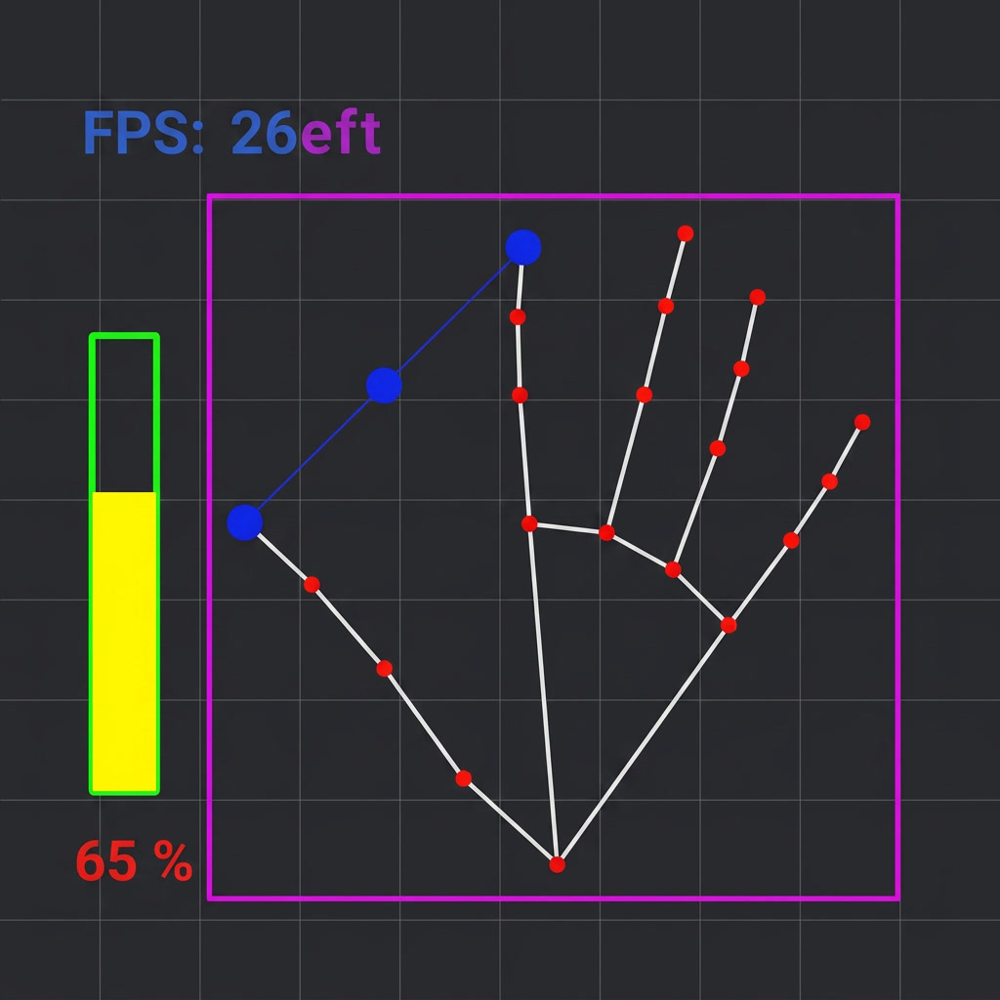

# 🖐️ Hand Gesture Volume Control

Control your system volume using hand gestures — no touch required!  
Built with Python, OpenCV, MediaPipe, and pycaw.

---

## ✨ Features

- 🖐️ Real-time hand detection via webcam
- 🔊 Control system volume by pinching fingers
- 📊 Live volume bar and percentage display
- 🎯 FPS counter on screen
- 🪞 Mirror mode (flipped camera)

---

## 🖼️ Screenshot



---

## 🛠️ Requirements

- Python 3.10
- Webcam

### Libraries

```bash
pip install opencv-python numpy cvzone mediapipe pycaw comtypes
```

---

## 🚀 Installation & Usage

```bash
# 1. Clone the repository
git clone https://github.com/avazazizov/hand-volume-control.git
cd hand-volume-control

# 2. Create a conda environment
conda create -n handtrack python=3.10
conda activate handtrack

# 3. Install dependencies
pip install opencv-python numpy cvzone==1.5.6 mediapipe==0.10.5 pycaw comtypes

# 4. Run the project
python project.py
```

---

## 🎮 How It Works

| Gesture | Action |
|---|---|
| 👆👍 Fingers far apart | Volume UP |
| 🤏 Fingers close together | Volume DOWN |

The distance between your **thumb tip** and **index finger tip** controls the volume level in real time.

```
Distance: 50px  → Volume: 0%
Distance: 300px → Volume: 100%
```

---

## 📁 Project Structure

```
hand-volume-control/
│
├── project.py              # Main script
├── README.md               # This file
└── assets/
    └── volume.png          # Screenshot
```

---

## ⚙️ How Volume Bar Works

The color of the volume bar changes based on level:

- 🟢 Green → 0–20%
- 🟡 Yellow → 20–80%
- 🔴 Red → 80–100%

---

## 🧠 Tech Stack

| Tool | Purpose |
|---|---|
| OpenCV | Camera & image processing |
| MediaPipe (via cvzone) | Hand landmark detection |
| pycaw | Windows audio control |
| NumPy | Value interpolation |

---

## 👤 Author

GitHub: [Avaz Azizov](https://github.com/avazazizov)
